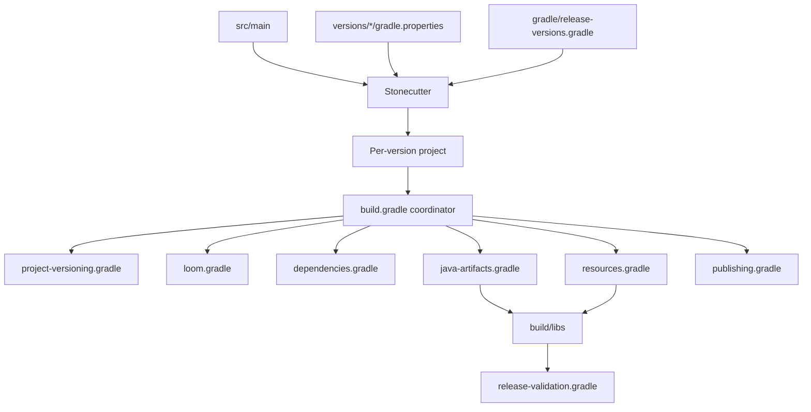
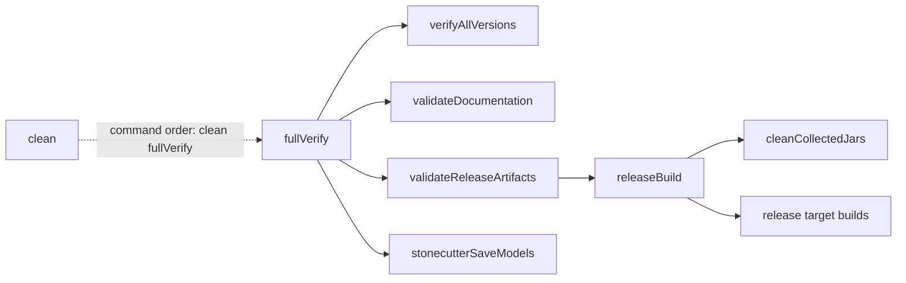

# Fresh Armor Bar: multiversion guide

This guide explains how one Fresh Armor Bar repository builds several Minecraft versions. No previous Stonecutter knowledge is required.

## Contents

- [How the project works](#how-the-project-works)
- [Supported targets](#supported-targets)
- [Where versions are configured](#where-versions-are-configured)
- [Shared and version-specific code](#shared-and-version-specific-code)
- [Changing the active version](#changing-the-active-version)
- [Running the client](#running-the-client)
- [Java requirements](#java-requirements)
- [Build commands](#build-commands)
- [Task graph and contracts](#task-graph-and-contracts)
- [Stonecutter models and clean](#stonecutter-models-and-clean)
- [Release artifacts and metadata](#release-artifacts-and-metadata)
- [Release groups](#release-groups)
- [Project invariants](#project-invariants)
- [What fullVerify does not test](#what-fullverify-does-not-test)
- [Documentation checks](#documentation-checks)
- [Configuration cache](#configuration-cache)
- [Adding a target](#adding-a-target)
- [Porting across large API changes](#porting-across-large-api-changes)
- [Version support policy](#version-support-policy)
- [Manual release checklist](#manual-release-checklist)
- [Quick troubleshooting](#quick-troubleshooting)
- [Key files](#key-files)

## How the project works

The mod has one shared source tree:

```text
src/main/java
src/main/resources
```

Stonecutter adapts that source for each Minecraft target. Fabric Loom then compiles each target and the artifact tasks collect release jars in `build/libs`.



This avoids maintaining five copies of the same mod. Stonecutter and Loom are build tools only; players do not need them.

Useful terms:

- **Target:** one supported Minecraft version.
- **Active version:** the target currently selected for editing and `runClient`.
- **Directive:** a Stonecutter comment that selects code for particular versions.
- **Model:** generated JSON used by Stonecutter and the IDE. Every target has a `node.json`.
- **Artifact:** a final binary jar or sources jar.

## Supported targets

| Minecraft | Mappings          | Bytecode | Direct Trinkets compile dependency |
|-----------|-------------------|---------:|------------------------------------|
| 1.20.1    | Yarn              |  Java 17 | Trinkets 3.7.2                     |
| 1.21.1    | Yarn              |  Java 21 | Trinkets 3.10.0                    |
| 1.21.11   | Yarn              |  Java 21 | Trinkets 3.10.0                    |
| 26.1.2    | Official mappings |  Java 25 | None                               |
| 26.2      | Official mappings |  Java 25 | None                               |

The committed default active version is `1.20.1`.

## Where versions are configured

Shared values are defined once:

- `gradle.properties`: Loader `0.19.3`, mod name, group and mod version.
- `stonecutter.gradle`: Loom `1.17-SNAPSHOT` and the active-version marker.
- `gradle/wrapper/gradle-wrapper.properties`: Gradle `9.6.1`.
- `gradle/release-versions.gradle`: targets and release groups.

Target-specific values live in:

```text
versions/<minecraft-version>/gradle.properties
```

They contain only values that change between targets: Minecraft, mappings, development Fabric API, Mod Menu, Trinkets and MixinExtras versions.

Do not duplicate shared values such as `mod_version`, `loader_version` or Loom in those files.

`dev_fabric_api_version` is only for the development environment. Fabric API is not a required or suggested dependency in the published mod metadata.

## Shared and version-specific code

Rendering, textures, trims, glint, feedback effects, configuration, Elytra lookup and resources are shared.

Stonecutter directives cover only Minecraft API differences, for example:

- `Identifier` creation;
- armor trim and dyed-color access;
- armor material and equipment asset types;
- HUD hook methods;
- GUI drawing and vertex APIs;
- Yarn versus official mappings;
- the newer masked glint path.

A real import split from `InGameHudMixin.java` looks like this:

```java
//? if >=26.1.2 {
/*import net.minecraft.resources.Identifier;
*///?} else {
import net.minecraft.util.Identifier;
//?}
```

The inactive branch is preserved inside a block comment so every generated target remains valid Java after Stonecutter preprocessing. The project uses the same pattern for Yarn versus official class names, `DrawContext` versus `GuiGraphicsExtractor`, HUD hooks, item access and rendering pipelines.

Do not reformat or move these comments unless you are intentionally changing version behavior.

Fresh Armor Bar remains client-side on every target. Mod Menu and Trinkets-family integrations are optional. Targets 26.1.2+ discover compatible Elytra-slot APIs through guarded reflection instead of compiling directly against Trinkets.

## Changing the active version

### IntelliJ IDEA

1. Install the Stonecutter Dev plugin.
2. Import or reload the repository as a Gradle project.
3. Select a version with the Stonecutter selector.
4. Wait for the Gradle refresh.
5. Run `Minecraft Client`.

The client configuration starts the active version; it does not switch versions.

Generated IntelliJ switch actions are disabled to keep the run list clean, but the official Gradle switch tasks still exist.

### Terminal

Example:

```powershell
.\gradlew.bat stonecutterSwitchTo1.21.11 --no-daemon
```

On Unix-like systems:

```bash
./gradlew stonecutterSwitchTo1.21.11 --no-daemon
```

The selected version is written to the `stonecutter.active(...)` marker in `stonecutter.gradle`.

## Running the client

Select a version first, then run:

```powershell
.\gradlew.bat minecraftClient
```

On Unix-like systems, replace `.\gradlew.bat` with `./gradlew`.

The root task delegates to `runClient` in the active target. Every target uses the shared `run` directory.

## Java requirements

- Use the included Gradle Wrapper.
- Gradle itself needs Java 21 or newer.
- Minecraft 26.1.2 and 26.2 need a Java 25 toolchain.
- Target bytecode remains Java 17, 21 or 25 as shown in the target table.

The Gradle daemon JVM is described by `gradle/gradle-daemon-jvm.properties`. In IntelliJ, choose Java 21 or the wrapper/daemon JVM option for Gradle; do not select Java 17 as the Gradle JVM.

## Build commands

| Goal                        | Windows command                                      |
|-----------------------------|------------------------------------------------------|
| Run the active client       | `.\gradlew.bat minecraftClient`                      |
| Build one target            | `.\gradlew.bat :1.21.11:build --no-daemon`           |
| Compile all targets         | `.\gradlew.bat verifyAllVersions --no-daemon`        |
| Create clean release jars   | `.\gradlew.bat releaseBuild --no-daemon`             |
| Validate jars and metadata  | `.\gradlew.bat validateReleaseArtifacts --no-daemon` |
| Run every check             | `.\gradlew.bat fullVerify --no-daemon`               |
| Clean, then run every check | `.\gradlew.bat clean fullVerify --no-daemon`         |

What the main tasks do:

- `verifyAllVersions` compiles all five targets.
- `releaseBuild` clears `build/libs` and rebuilds the configured release jars.
- `validateReleaseArtifacts` checks jar names, sources jars and generated metadata. It also rejects unexpected jars and Fabric API metadata dependencies.
- `fullVerify` combines compilation, release validation and Stonecutter model generation.

`buildAllVersions` and `buildAndCollect` remain only as compatibility aliases for older workflows.

The recommended pre-push and pre-release command is:

```powershell
.\gradlew.bat clean fullVerify --no-daemon
```

It cleans the project, builds every target, validates the artifacts and restores all Stonecutter models in one invocation. GitHub Actions runs the same command.

## Task graph and contracts

In this diagram, a solid arrow means "depends on". `clean` is intentionally separate: Gradle executes it first only when both tasks are requested on the command line.



`mustRunAfter(verifyAllVersions)` orders release validation after the compatibility builds when both are present; it does not create another dependency.

| Task                       | Inputs                               | Outputs                         | Passing guarantees                              |
|----------------------------|--------------------------------------|---------------------------------|-------------------------------------------------|
| `verifyAllVersions`        | Shared sources, target properties    | Build output for every target   | Every configured target compiles and checks     |
| `releaseBuild`             | Release groups and target builds     | JARs in `build/libs`            | Old collected JARs are removed and rebuilt      |
| `validateReleaseArtifacts` | Collected JARs and shared metadata   | No additional artifact          | Names, pairs, license and metadata are coherent |
| `stonecutterSaveModels`    | Stonecutter target configuration     | Branch, tree and node models    | IDE models exist for every configured target    |
| `validateDocumentation`    | Markdown and shared build properties | No generated output             | Targets, JAR names, Loader and scripts agree    |
| `fullVerify`               | Complete repository                  | Builds, release JARs and models | All automated build guarantees pass together    |

The standalone root `clean` task deletes the root build directory. Per-version `clean` tasks delete their own target build directories.

## Stonecutter models and `clean`

Stonecutter uses these generated files:

```text
build/stonecutter-cache/branch.json
build/stonecutter-cache/tree.json
versions/1.20.1/build/stonecutter-cache/node.json
versions/1.21.1/build/stonecutter-cache/node.json
versions/1.21.11/build/stonecutter-cache/node.json
versions/26.1.2/build/stonecutter-cache/node.json
versions/26.2/build/stonecutter-cache/node.json
```

Do not edit or commit them. `clean` removes them, and `fullVerify` recreates them through `stonecutterSaveModels`.

This is why `clean fullVerify` must finish before using the Stonecutter selector again. If IntelliJ still shows old information after a successful build, reload the Gradle project.

## Release artifacts and metadata

Final binary and sources jars are written to:

```text
build/libs
```

Current binary names are:

```text
FreshArmorBar-2.1-1.20.1.jar
FreshArmorBar-2.1-1.21.1.jar
FreshArmorBar-2.1-1.21.11.jar
FreshArmorBar-2.1-26.1.2.jar
FreshArmorBar-2.1-26.2.jar
```

Do not publish jars from `versions/<version>/build` or `build/devlibs`; those are working artifacts.

`src/main/resources/fabric.mod.json` is a template. Each target generates its own version, Minecraft requirement, Java requirement and Loader requirement.

Every final jar currently declares:

```json
{
  "fabricloader": ">=0.19.3"
}
```

The same central `loader_version=0.19.3` is used for development, compilation and the minimum published requirement.

## Release groups

`stonecutterMinecraftVersions` lists every target that must compile. `releaseMinecraftVersionSets` separately defines which targets produce distinct published artifacts:

```groovy
ext.releaseMinecraftVersionSets = [
        ['1.20.1'],
        ['1.21.1'],
        ['1.21.11'],
        ['26.1.2'],
        ['26.2']
]
```

At present each target has its own JAR. A group can contain multiple versions only when the exact same compiled artifact and metadata are valid for every member. For example, this hypothetical group:

```groovy
['1.21.1', '1.21.2', '1.21.3']
```

would use the compact suffix `1.21.1-3`, declare all three Minecraft versions in `fabric.mod.json`, and build the first target as the representative release project. Every version can still remain in `stonecutterMinecraftVersions` and be compiled by `verifyAllVersions` even when it does not produce a separate JAR.

Never group versions merely because their source currently compiles. The representative bytecode, mappings, runtime behavior and metadata must all be interchangeable. A wrong group can produce a valid-looking JAR that fails when loaded on one of its declared versions; test every member manually before merging a group.

## Project invariants

The build and release workflow assume that:

1. shared code remains in `src/`;
2. target directories contain properties and generated work only;
3. `loader_version` has one source of truth in `gradle.properties`;
4. every release binary has a matching sources JAR;
5. every binary and sources JAR contains `LICENSE_FreshArmorBar`;
6. Fabric API is never emitted as a required or suggested metadata dependency;
7. `build/libs` contains only expected release artifacts;
8. every supported target has a valid Stonecutter model;
9. target-specific API differences use the smallest practical Stonecutter directive.

`validateReleaseArtifacts` enforces the artifact-related invariants. `verifyAllVersions` and `stonecutterSaveModels` enforce compilation and model generation.

## What `fullVerify` does not test

A successful `fullVerify` confirms build and artifact correctness, but does not guarantee:

- correct visual rendering in every game state;
- compatibility with every HUD mod;
- behavior of every optional third-party slot mod;
- visual correctness with custom resource packs;
- absence of runtime problems caused by external mods;
- persistence and usability of every configuration control.

Use the manual release checklist in addition to the automated build.

## Documentation checks

Documentation has two automated layers:

- GitHub Actions runs markdownlint over every Markdown file and Lychee over local and external links.
- `validateDocumentation`, included in `fullVerify`, compares the documented Minecraft targets, release JAR names, minimum Loader and Gradle script list with the real build properties and files.

This catches structural drift when a target, artifact version or build script changes. Narrative claims and screenshots still require human review.

## Configuration cache

Configuration cache is disabled by default because IntelliJ and Fabric Loom integration may still require the traditional configuration path. The build can be checked explicitly with:

```powershell
.\gradlew.bat fullVerify --configuration-cache --configuration-cache-problems=fail --no-daemon
```

A second identical run should report that the cache entry was reused.

## Adding a target

1. Add the version to `stonecutterMinecraftVersions` in `gradle/release-versions.gradle`.
2. Add its release group to `releaseMinecraftVersionSets`.
3. Create `versions/<version>/gradle.properties` with only target-specific values.
4. Switch to the new target and build it by itself.
5. Add the smallest necessary Stonecutter directives for API differences.
6. Run `clean fullVerify`.
7. Check the jar, sources jar, generated metadata and new `node.json`.

Do not copy the whole source tree. Normal behavior stays in `src/`; only genuine API differences use directives.

## Porting across large API changes

When a Minecraft update changes several APIs at once:

1. add the target and its properties without changing unrelated targets;
2. build only the new target and group compiler errors by area: mappings, HUD hook, rendering, items, trims and optional integrations;
3. solve one area at a time and rebuild the target after each coherent change;
4. keep shared behavior outside directives and avoid duplicating whole classes;
5. place each directive around the smallest import, type, method or expression that genuinely differs;
6. switch to the new target and launch `minecraftClient`;
7. verify empty, partial, mixed and full armor plus trim, glint, Elytra, configuration, damage and Mending feedback;
8. switch back to the oldest supported target and run a smoke test;
9. finish with `clean fullVerify` and inspect the produced metadata.

If the same conditional appears repeatedly, first look for a small shared adapter method. A directive is preferable when the difference is a direct Minecraft name or signature change; an adapter is preferable when it isolates reusable behavior.

## Version support policy

- Every target listed in `stonecutterMinecraftVersions` is supported by the current source and CI build.
- The newest target receives features and bug fixes first.
- Older listed targets receive compatibility and critical fixes when practical; feature backports are evaluated case by case.
- A target may be retired when its toolchain is no longer usable or maintaining it would require substantial source duplication.
- Target removal must update the release groups, target properties, documentation and release notes together.
- "Supported" guarantees a maintained build target, not compatibility with every third-party mod or resource pack.

## Manual release checklist

For every release candidate:

- [ ] Launch the oldest supported target.
- [ ] Launch the newest supported target.
- [ ] Test no armor, partial armor and full armor.
- [ ] Test mixed armor materials.
- [ ] Test dyed leather.
- [ ] Test trims and glowing trims.
- [ ] Test enchanted armor.
- [ ] Test Elytra in the vanilla slot.
- [ ] Test an optional Elytra-slot integration where available.
- [ ] Test every damage feedback category.
- [ ] Test Mending repair feedback.
- [ ] Open and save the Mod Menu configuration.
- [ ] Confirm that configuration persists after restart.
- [ ] Test a resource-pack override and the unknown-material fallback.
- [ ] Run `.\gradlew.bat clean fullVerify --no-daemon`.
- [ ] Inspect the final binary and sources JAR names in `build/libs`.

## Quick troubleshooting

| Error or symptom                        | Likely cause                            | Resolution                                               |
|-----------------------------------------|-----------------------------------------|----------------------------------------------------------|
| `Missing release jar`                   | Release target was not built            | Run `releaseBuild` and inspect the target build          |
| `Unexpected jar(s)`                     | Stale files remain in `build/libs`      | Run `cleanCollectedJars` or `clean fullVerify`           |
| `Missing fabric.mod.json`               | Resource generation or packaging failed | Check `resources.gradle` and the generated resource tree |
| Loader metadata mismatch                | Loader value is no longer central       | Check `loader_version` in `gradle.properties`            |
| Missing release sources JAR             | Sources artifact was not collected      | Check `java-artifacts.gradle` and rebuild                |
| Missing `LICENSE_FreshArmorBar`         | License packaging was changed           | Check `java-artifacts.gradle`                            |
| Stonecutter cannot switch after clean   | Generated `node.json` files are gone    | Run `fullVerify`, then reload Gradle                     |
| Wrong Minecraft version starts          | Active version was not switched         | Switch, wait for refresh, then run `minecraftClient`     |
| Java toolchain cannot be found          | Required JDK is unavailable             | Install/configure JDK 25 for the 26.x targets            |
| Gradle builds but IntelliJ shows errors | IDE model or Gradle JVM is stale        | Reload Gradle and use Java 21+ as the Gradle JVM         |

## Key files

| Path                                     | Purpose                              |
|------------------------------------------|--------------------------------------|
| `src/main/java`                          | Shared Java source                   |
| `src/main/resources`                     | Shared metadata, mixins and assets   |
| `versions/<version>/gradle.properties`   | Target-specific versions             |
| `gradle/release-versions.gradle`         | Target and release lists             |
| `gradle/version-utils.gradle`            | Minecraft version-range helpers      |
| `gradle/root-tasks.gradle`               | Root lifecycle and build tasks       |
| `gradle/documentation-validation.gradle` | Documentation/build consistency      |
| `gradle/release-validation.gradle`       | Release JAR and metadata checks      |
| `gradle/project-versioning.gradle`       | Artifact and Java target values      |
| `gradle/loom.gradle`                     | Loom mod and run configuration       |
| `gradle/dependencies.gradle`             | Repositories and target dependencies |
| `gradle/resources.gradle`                | Metadata and resource generation     |
| `gradle/java-artifacts.gradle`           | Java toolchains and JAR outputs      |
| `gradle/publishing.gradle`               | Publication and legacy aliases       |
| `gradle.properties`                      | Shared Loader and mod values         |
| `stonecutter.gradle`                     | Loom and active version              |
| `settings.gradle`                        | Settings script coordinator          |
| `build.gradle`                           | Target script coordinator            |
| `.run/Minecraft Client.run.xml`          | Shared IntelliJ launcher             |
| `build/libs`                             | Final release artifacts              |

`settings.gradle` applies `release-versions.gradle`, `version-utils.gradle`, `root-tasks.gradle`, `documentation-validation.gradle` and `release-validation.gradle`. `build.gradle` is the target-build coordinator for the dedicated versioning, Loom, dependency, resource, Java/artifact and publishing scripts.

The safest rule is simple: shared behavior belongs in `src/`, version numbers belong in properties, and Stonecutter directives are only for real Minecraft API differences.
